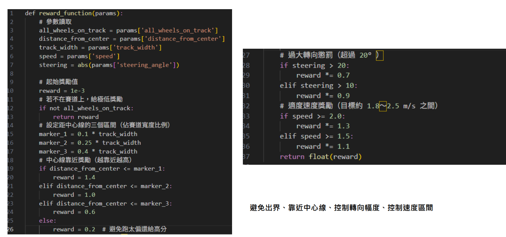
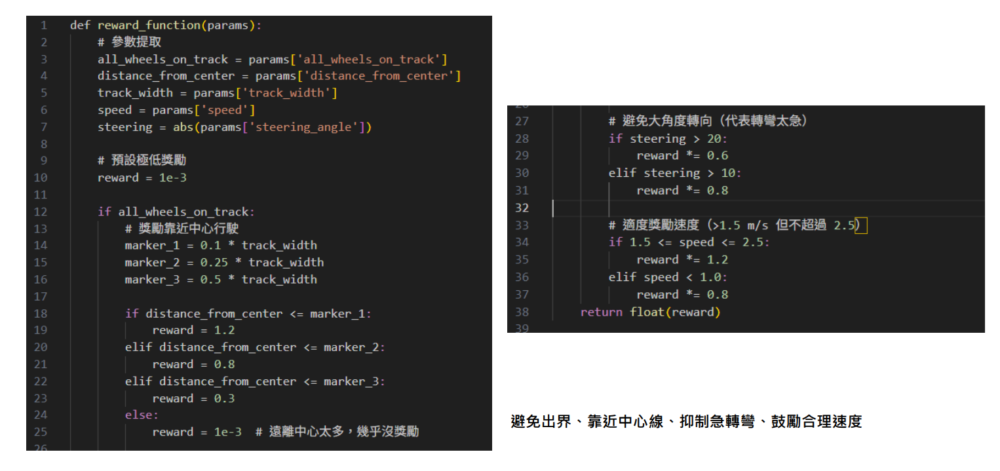
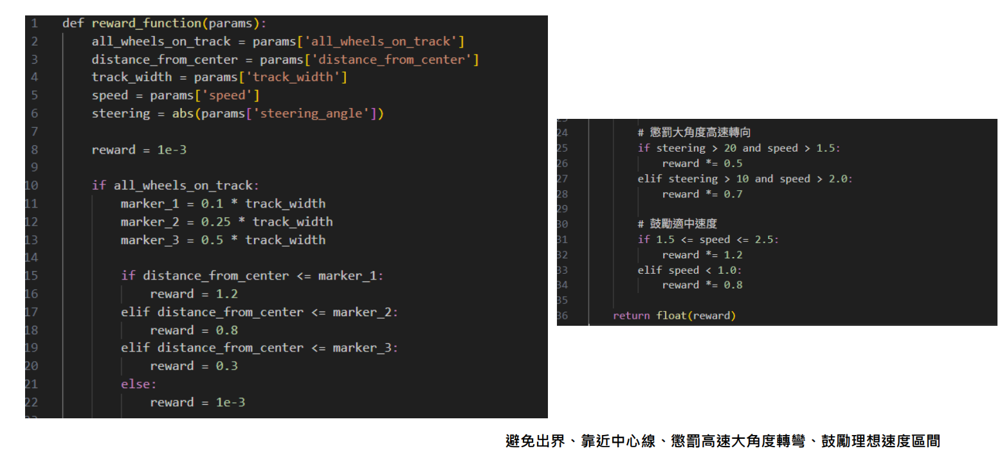

# 第二組 - AI 賽車模型訓練報告

**組員：陳柏安、夏揚祈、葉欲彥、陳柏翰**

---

## 📘 專案簡介

本專案旨在透過 AWS DeepRacer 平台與強化學習（Reinforcement Learning, RL）技術，訓練一輛虛擬自駕車在賽道上完成高速且穩定的繞圈。訓練過程中我們設計 reward function 引導模型學習理想的駕駛行為，並分為四個階段逐步優化。

使用的學習方法為 DQN 為基礎的強化學習架構，透過反覆試誤方式學習出在不同賽道位置應採取的最佳行動（Action），並根據我們定義的 reward 函數調整學習策略。

---

## 🧭 訓練目標與評估指標

我們的訓練重點圍繞以下四大核心：

1. **穩定性**：保持四輪在賽道內，避免出界。
2. **路徑優化**：靠近中心線行駛以減少偏移與碰撞風險。
3. **動作平滑性**：降低急轉彎（過大角度）操作。
4. **速度效率**：鼓勵適中偏快的速度（避免太慢或太快造成失控）。

**評估指標包含：**
- 單圈完成時間（越短越佳）
- 成功繞圈率（不出界的圈數比率）
- 模型穩定度（行為一致性）

---

## 🌀 第一階段：基礎穩定訓練

- **目標**：建立基本能力，完成單圈不出界。
- **reward 設計重點**：
  - `all_wheels_on_track` 為否時直接給極低獎勵。
  - 使用 `distance_from_center` 分為三段距離評分，越靠近中心獎勵越高。
  - 若轉彎角度過大（>20°）開始懲罰。
  - 太慢（<1.2 m/s）則給獎勵，鼓勵「穩中求快」。

- **結果**：
  - 模型可穩定完成單圈，無出界情形。
  - 單圈時間約 25 秒，偏慢但安全。

📸 圖片參考：

---

## 🚧 第二階段：速度提升嘗試

- **目標**：縮短單圈時間，提升速度表現。
- **reward 設計重點**：
  - 修改速度獎勵區間，鼓勵達 1.8~2.5 m/s。
  - 降低對角度懲罰的權重，讓模型能承受一定程度的激進操作。
  - 保留中心線距離獎勵作為方向參考。

- **結果**：
  - 單圈速度有明顯提升，但導致大量出界與失控。
  - 成功率下降至約 30~40%。

📸 圖片參考：

---

## ⚖️ 第三階段：速度與穩定性權衡

- **目標**：在保持較高速度的前提下回穩模型表現。
- **reward 設計重點**：
  - 明確限制速度與轉向角的搭配，例如「高速 + 急轉」給予高懲罰。
  - 建立精細的速度區間獎勵：
    - 1.5~2.5 m/s 給予額外獎勵
    - <1.0 m/s 給予懲罰以避免過慢
  - 中心線靠近邏輯進行微調，提升對偏離過多的懲罰力度。

- **結果**：
  - 單圈完成時間約 15~18 秒，表現較穩。
  - 成功率上升至 70~80%，但模型行為仍不完全穩定。

📸 圖片參考：

---

## 🏁 第四階段：成熟策略整合

- **目標**：達到穩定、高速與自然駕駛風格的整合。
- **reward 設計重點**：
  - 對「高速大角度轉彎」嚴懲（如 speed > 2.0 + steering > 10°）
  - 鼓勵模型在「1.5 ~ 2.5 m/s」內流暢行駛。
  - 完整使用距離 + 角度 + 速度三因子交互影響 reward。
  - 避免極端情況如：外圈飄移、內線急壓、蛇行擺動。

- **結果**：
  - 單圈穩定達 13 秒，成功率 100%。
  - 模型在不同起點與變速情境下表現一致，具備泛化能力。

📸 圖片參考：

---

## 📊 訓練階段比較一覽表

| 階段       | 單圈時間 | 成功率 | 特徵                         |
|------------|----------|--------|------------------------------|
| 第1階段    | 約 25 秒 | 100%   | 保守穩定，偏慢               |
| 第2階段    | 約 18 秒 | ~30%   | 速度提升但不穩               |
| 第3階段    | 15~18 秒 | ~70%   | 改善穩定但略不一致           |
| 第4階段    | 約 13 秒 | 100%   | 高速穩定，策略成熟           |

---

## 📌 reward function 設計思路總結

以下為最終 reward 設計策略邏輯：

- ❗ 出界（all_wheels_on_track = False）立即 return `1e-3`
- ✅ 距離中心線越近 → reward 乘以 1.2~1.4
- ⚠️ 過大轉向角（steering > 20°）→ reward 乘以 0.6
- 🏎️ 合理速度（1.5 ≤ speed ≤ 2.5）→ reward 乘以 1.2
- ❌ 高速大角度轉彎 → reward 降至 0.5 以下
- 📉 速度過慢（< 1.0）→ reward 乘以 0.8 或直接懲罰

---

## 🧠 結語與心得

本專案讓我們深刻理解了強化學習中 reward function 的主導性：  
模型不僅會依據我們設計的獎勵函數學習策略，更會「優化我們沒注意到的邏輯漏洞」。在設計不夠平衡的獎懲邏輯時，模型容易發展出極端策略（如蛇行、飄移、爆速壓彎），反而失去原始目標。

透過反覆調整與觀察模型行為，我們逐步建立了能穩定且高速完成任務的自駕模型，也對機器學習中「行為塑造」有了更深的體會。

我們相信此模型具備良好可遷移性，未來可延伸至不同賽道與任務條件下，進一步探索自動駕駛在 RL 領域的應用潛力。
