# AI_CAR_1_QQnumberOne
課程名稱：機器學習 
班級：電子三乙 
學號及姓名：111360231呂佳家、111360235馬赫行、111360236謝子涵 
組名：第一組 QQnumberOne 

# 線下賽部分
### 模型名稱：313536 
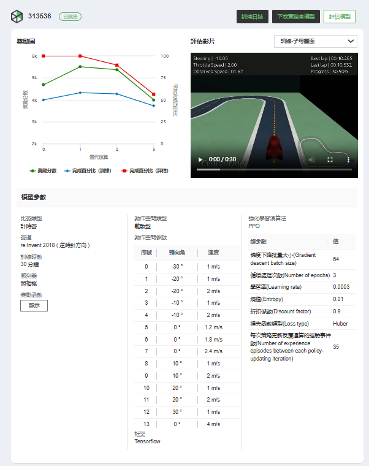 

選用這個模型的理由： 
由以下評估模型可以看到，賽車模型的完成率非常高，表示比較穩定，可以減少賽車出軌的機率，其中有4個都達到100%。 
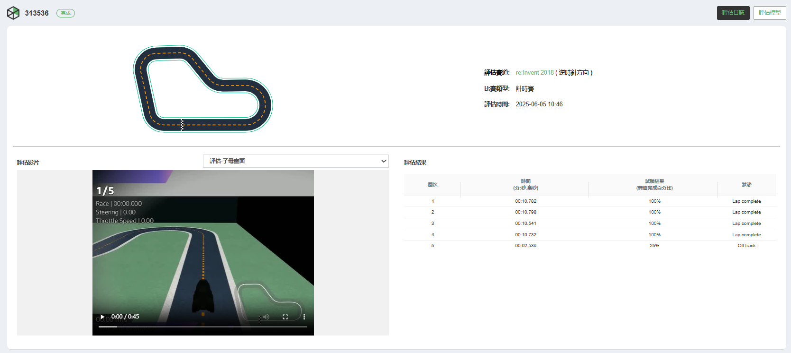 

### 獎勵函數：[點我看文字檔](reward%20funtion/313536.txt) 

### 訓練日誌： 
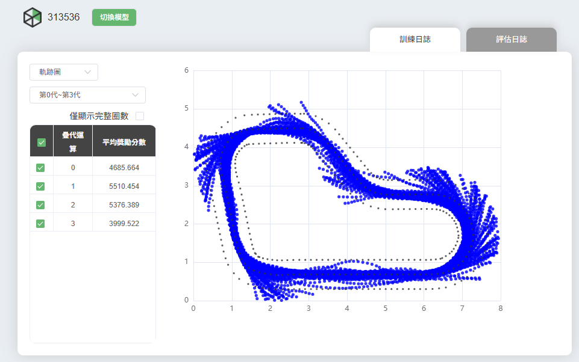 

### 評估日誌： 
 

### 比賽： 
線下賽最快的時間：12.36秒 
名次：1/11 

# 線上賽部分
最初始模型名稱：313536a0605 
從313536a0605這個模型開始修正到313536a0605-clone6 

 
訓練時數(min)： 

| 313536a0605 | -clone1  | -clone2  | -clone3  | -clone4  | -clone5  | -clone6  |
|---------------|----------|----------|----------|----------|----------|----------|
| 30                   | 60           | 60           | 60           | 60           | 60           | 60           |
 

### 313536a0605到-clone5的參數設定(除了訓練時數不一樣)： 
這邊可以看到，我們將原本預設的折扣係數0.5提升到0.9，每次策略更新反覆運算的經驗事件數也從20提升到35。
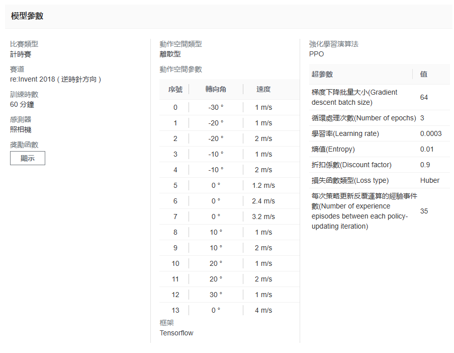 
再來看到評估的結果，穩定性有提高了，達到4個100%。 
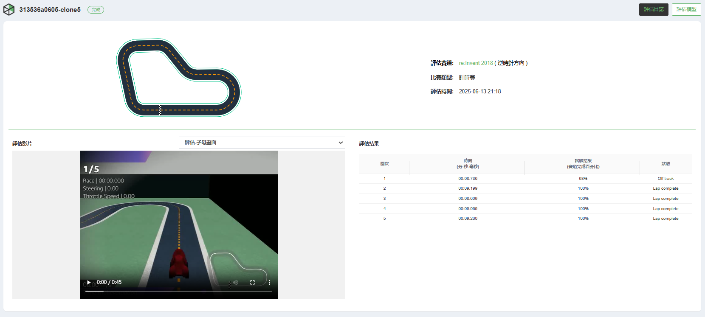 

### 313536a0605-clone6的參數設定： 
因為上面-clone5模型已經幾乎穩定，所以我們調整了0度時的速度(分別是序號5、6、7)，稍微加快了一點，希望在直線時能減少時間。 
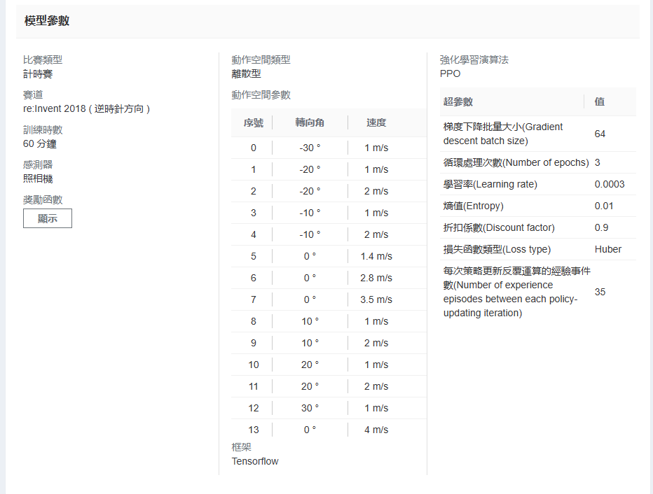 

### 獎勵函數(這7個模型都是使用這個獎勵函數進行訓練)：[點我看文字檔](reward%20funtion/313536a0605.txt) 
獎勵函數參考來源：[github連結](https://github.com/yang0369/AWS_DeepRacer/blob/main/reward_function(1.5).py) 

### 獎勵圖比較： 
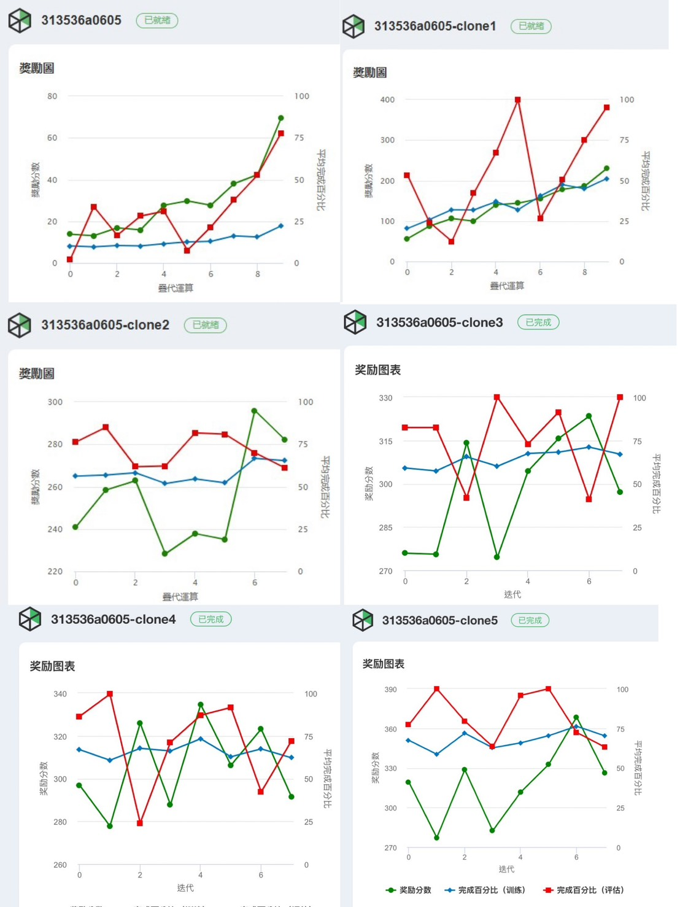 
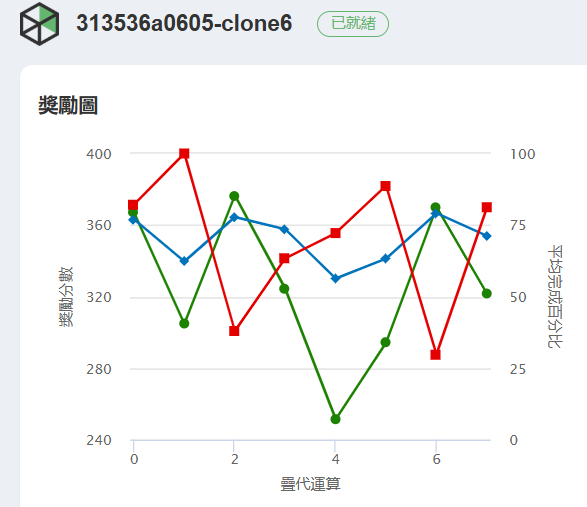 

### 訓練日誌： 
#### 最初的模型(313536a0605) 
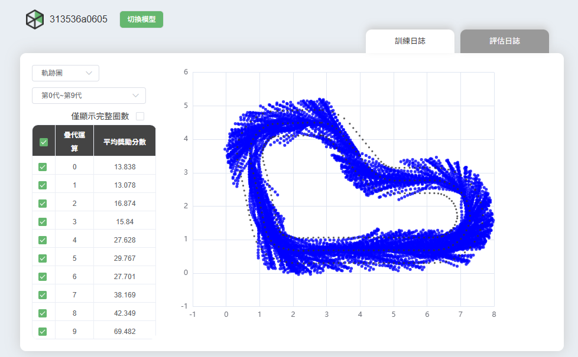 
#### 最終的模型1(313536a0605-clone5) 
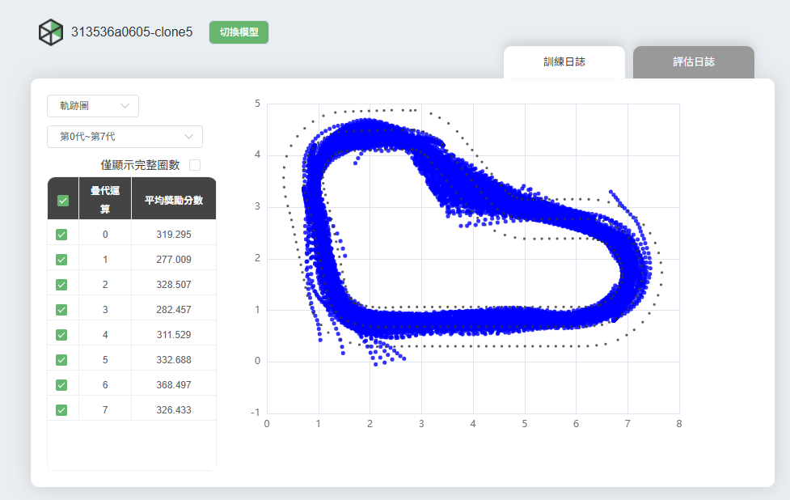 
#### 最終的模型2(313536a0605-clone6) 
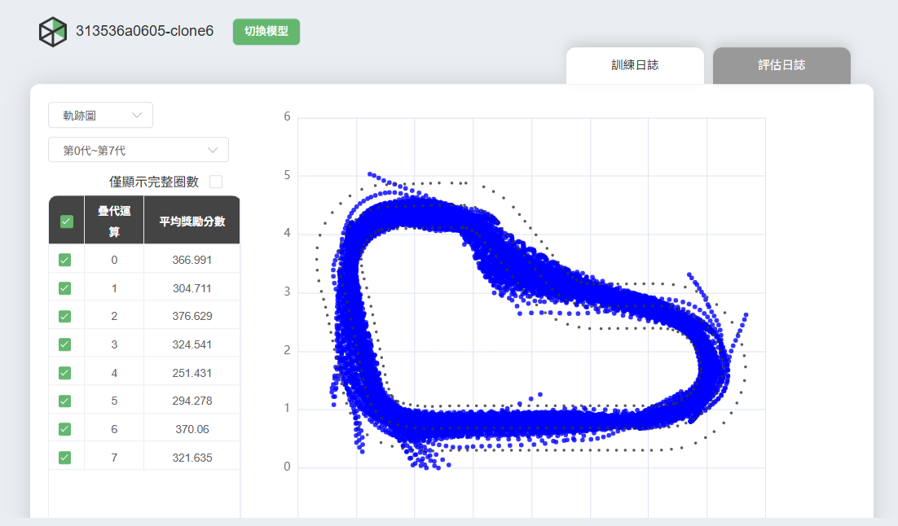 

### 評估日誌： 
#### 最初的模型(313536a0605) 
 
#### 最終的模型1(313536a0605-clone5) 
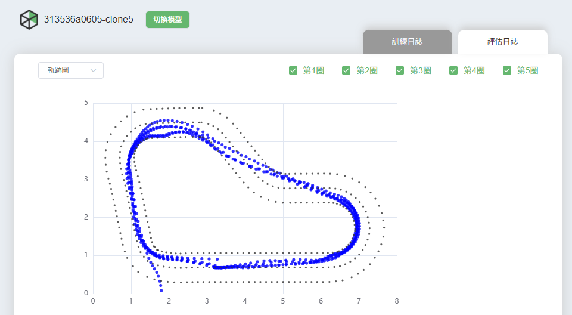 
由這以上兩張圖比較可得知，經歷了5.5小時的訓練的評估結果是比只訓練30分鐘的穩定很多，而且也比較接近最佳賽車線。 

#### 最終的模型2(313536a0605-clone6) 
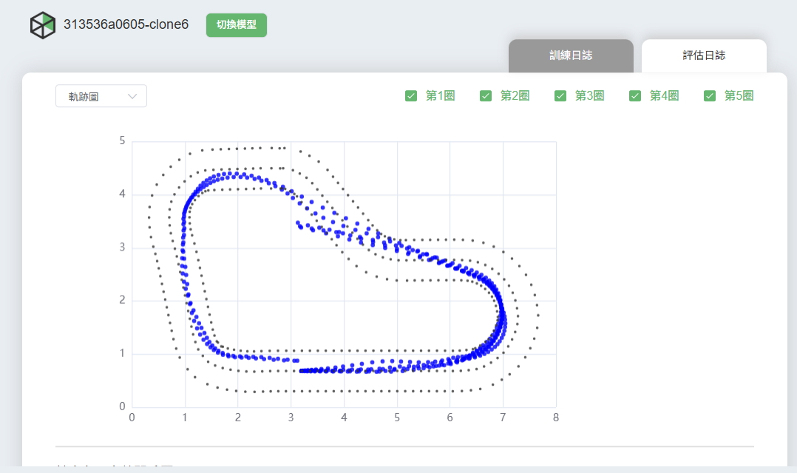 
由第二張及第三張圖可得知，增加0度時的速度，並且提高訓練時間讓評估結果更接近最佳賽車線，而且跑一圈的速度確實有提升。 

### 比賽情況： 
線上賽最快的時間：8.403秒，模型為313536a0605-clone6。 

