# 第十組
### 組員:黃泓瑋, 林建成, 李道賢, 莊旻諺
## 第一次訓練
  訓練40分鐘
- ### 動作空間
  
  彎道慢，直線比較快 
  同個轉向角多個不同的速度，系統會傾向reward較高的那一個

  
    |序號|轉向角|速度|            
    |---|---|---|
    |0|-30°|1m/s|
    |1|-30°|1.5m/s|
    |2|-15°|1.5m/s|
    |3|0°|2.5m/s|
    |4|0°|3m/s|
    |5|0°|3.5m/s|
    |6|15°|1.5m/s|
    |7|30°|1.5m/s|
    |8|30°|1m/s|
- ### 獎勵函數
    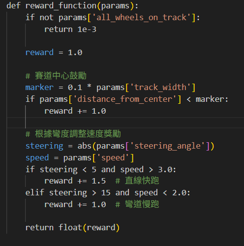
- ### 評估結果
    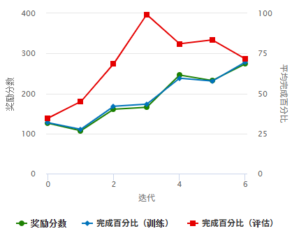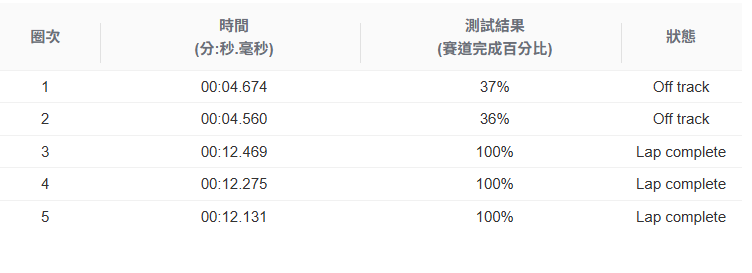

## 第二次訓練(線下賽模型)
  克隆一次，同樣的動作空間、獎勵函數，訓練20分鐘
- ### 評估結果
    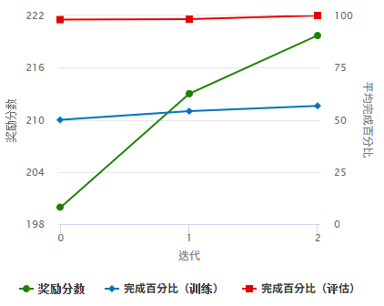
## 第三次訓練
  克隆第二次訓練，獎勵函數不變，提高動作空間部分速度，訓練20分鐘
- ### 動作空間
  |序號|轉向角|速度|            
    |---|---|---|
    |0|-30°|1.3m/s|
    |1|-30°|1.5m/s|
    |2|-15°|1.8m/s|
    |3|0°|2.8m/s|
    |4|0°|3m/s|
    |5|0°|3.8m/s|
    |6|15°|1.8m/s|
    |7|30°|1.5m/s|
    |8|30°|1.3m/s|
- ### 評估結果
    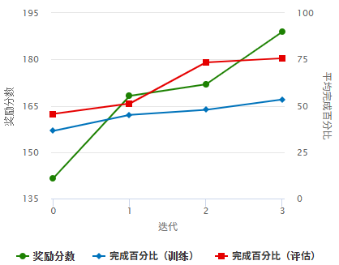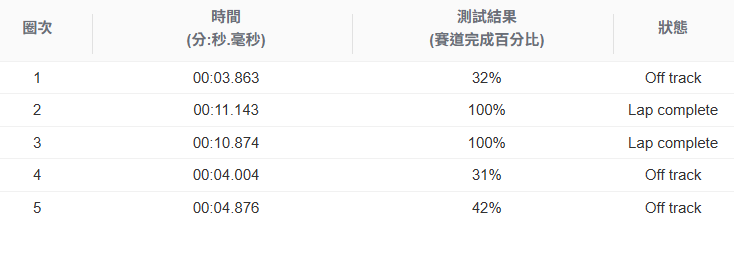
## 第四次訓練
  克隆第三次訓練，獎勵函數不變，動作空間不變，訓練20分鐘
- ### 評估結果
    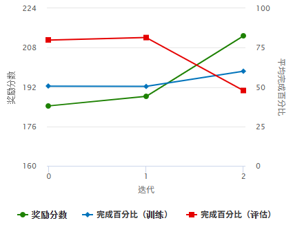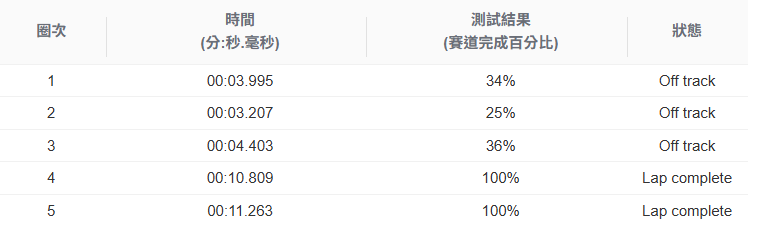
## 第五次訓練
  繼續克隆，訓練20分鐘
- ### 評估結果
    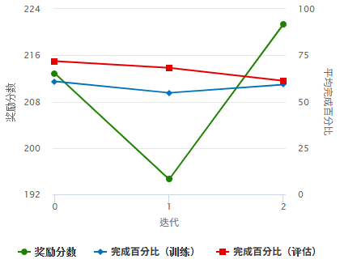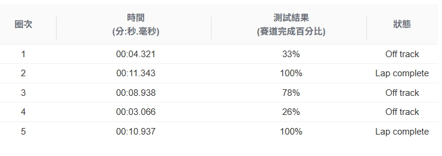
## 第六次訓練
  再繼續克隆，訓練20分鐘
- ### 評估結果
    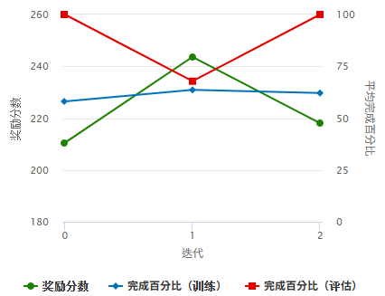
## 第七次訓練
  重覆訓練完成度變化不大，所以這次訓練克隆後動作空間不變，改變獎勵函數進行細部的調整，訓練20分鐘
- ### 獎勵函數
  - 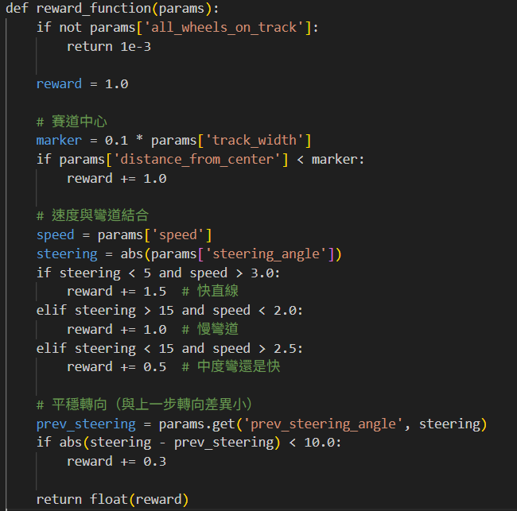
- ### 評估結果
    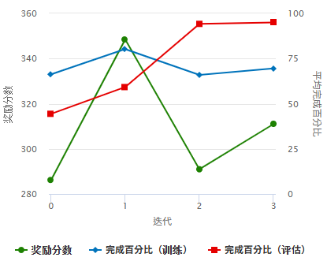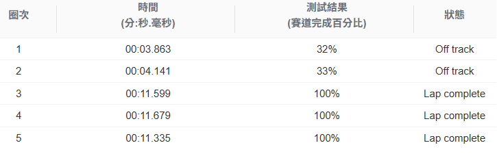
## 第八次訓練(線上賽模型)
  克隆後獎勵函數保持不變，新增更多角度的動作空間，訓練20分鐘
- ### 動作空間
    |序號|轉向角|速度|            
    |---|---|---|
    |0|-30°|1.5m/s|
    |1|-30°|1.8m/s|
    |2|-15°|2m/s|
    |3|-5°|3m/s|
    |4|0°|3.8m/s|
    |5|5°|3m/s|
    |6|15°|2m/s|
    |7|30°|1.5m/s|
    |8|30°|1.8m/s|

- ### 評估結果
    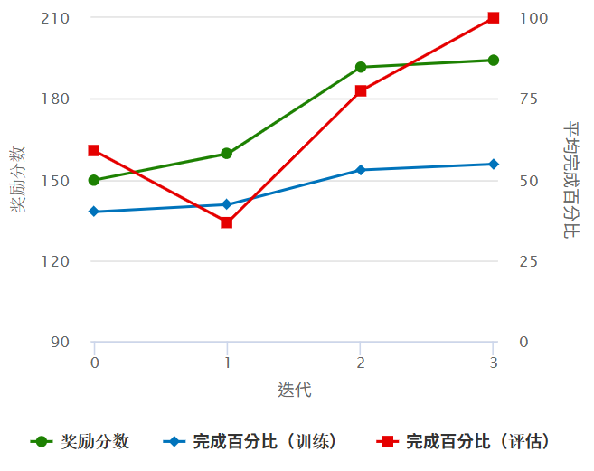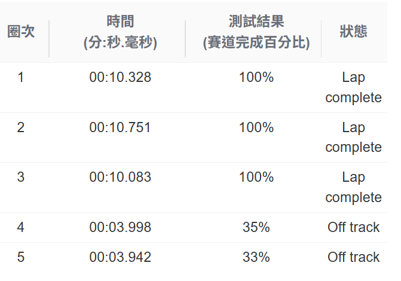
## 結論
  整體訓練過程下來，雖然嘗試了多種獎勵函數設計與動作空間調整，但結果仍未如預期明顯提升。在模型行為的學習方面，雖然從訓練曲線與模擬中可以觀察到部分行為模式的變化，例如模型在特定區段表現出較好的穩定性與過彎判斷，但整體圈速與完成率的進展仍不穩定，且與心理預期存在落差。

  此外，在多次迭代訓練中，即便持續嘗試不同組合的設定，我們仍未能訓練出比第八次更優秀的模型，這顯示現有 reward 機制與動作空間可能已到達其效果上限，或缺乏足夠針對性的激勵設計。

  因此，未來若要提升模型整體表現，除了技術上的調整，更應回到強化學習的核心邏輯，重新思考獎勵機制的設計意圖、動作空間的表現能力，以及模型的行為是否真的能從訓練回饋中學到有意義的策略。唯有在更深理解RL原理的前提下，我們才能設計出具備學習潛力與泛化能力的模型。

