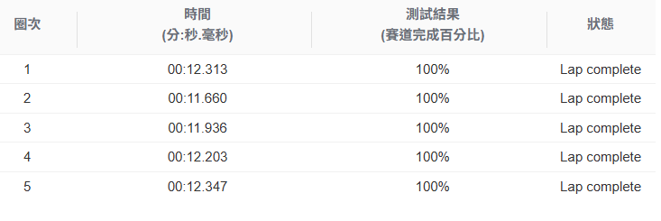

# 第六組
### 組員:黃泓瑋, 林建成, 李道賢, 莊旻諺
## 第一次訓練
  訓練40分鐘
- ### 動作空間
  
  彎道慢，直線比較快 
  同個轉向角多個不同的速度，系統會傾向reward較高的那一個

  
    |序號|轉向角|速度|            
    |---|---|---|
    |0|-30°|1m/s|
    |1|-30°|1.5m/s|
    |2|-15°|1.5m/s|
    |3|0°|2.5m/s|
    |4|0°|3m/s|
    |5|0°|3.5m/s|
    |6|15°|1.5m/s|
    |7|30°|1.5m/s|
    |8|30°|1m/s|
- ### 獎勵函數
    
- ### 評估結果
    

## 第二次訓練(線下賽模型)
  克隆一次，同樣的動作空間、獎勵函數，訓練20分鐘
- ### 評估結果
    
## 第三次訓練
  克隆第二次訓練，獎勵函數不變，提高動作空間部分速度，訓練20分鐘
- ### 動作空間
  |序號|轉向角|速度|            
    |---|---|---|
    |0|-30°|1.3m/s|
    |1|-30°|1.5m/s|
    |2|-15°|1.8m/s|
    |3|0°|2.8m/s|
    |4|0°|3m/s|
    |5|0°|3.8m/s|
    |6|15°|1.8m/s|
    |7|30°|1.5m/s|
    |8|30°|1.3m/s|
- ### 評估結果
    
## 第四次訓練
  克隆第三次訓練，獎勵函數不變，動作空間不變，訓練20分鐘
- ### 評估結果
    
## 第五次訓練
  繼續克隆，訓練20分鐘
- ### 評估結果
    
## 第六次訓練
  再繼續克隆，訓練20分鐘
- ### 評估結果
    
## 第七次訓練
  重覆訓練完成度變化不大，所以這次訓練克隆後動作空間不變，改變獎勵函數進行細部的調整，訓練20分鐘
- ### 獎勵函數
  - 
- ### 評估結果
    
## 第八次訓練(線上賽模型)
  克隆後獎勵函數保持不變，新增更多角度的動作空間，訓練20分鐘
- ### 動作空間
    |序號|轉向角|速度|            
    |---|---|---|
    |0|-30°|1.5m/s|
    |1|-30°|1.8m/s|
    |2|-15°|2m/s|
    |3|-5°|3m/s|
    |4|0°|3.8m/s|
    |5|5°|3m/s|
    |6|15°|2m/s|
    |7|30°|1.5m/s|
    |8|30°|1.8m/s|

- ### 評估結果
    

