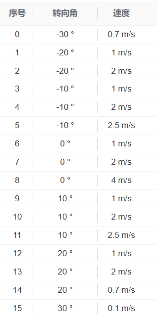
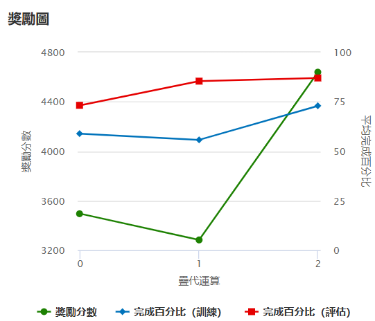
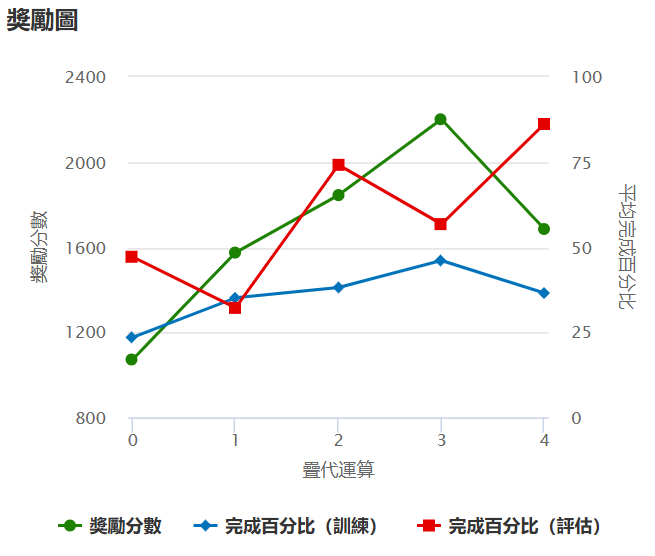
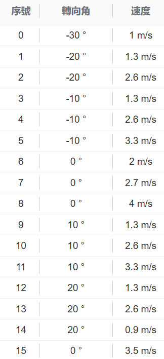
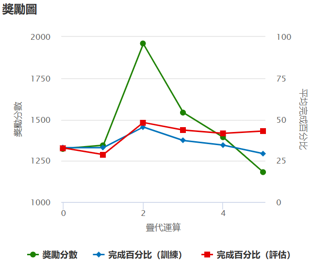
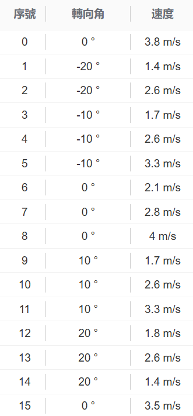

# ML 113-2 機器學習 AI 賽車報告

#### 第三組 組員：
| 班級 | 學號 | 姓名 |
| -------- | -------- | -------- |
| 電資三 | 111820006 | 陳羿錦 |
| 電資三 | 111820009 | 范姜芷妤 |
| 電資三 | 111820024 | 廖翊宏 |
| 電資三 | 111820034 | 賴昱宏 |

---
<!-- TrySeeSee -->
#### 起始模型

##### 起始策略(獎勵函數)：

- **基本安全策略**
    - 脫軌或倒車立即給予極低獎勵 (1e-26)
    - 確保車輛始終在賽道上且正向行駛

- **路線跟隨策略**
    - 使用前瞻性路徑規劃 (RANGE = 6 個路點)
    - 根據與理想路線距離給予階梯式獎勵
    - 距離  MAX_TURN/TURN_STEP 時獎勵減半
    - 鼓勵平穩駕駛，避免急轉

- **速度優化策略**
    - 線性獎勵當前速度與最高速度的比例
    - 獎勵值 = (當前速度 / 最高速度) × 100
    - 鼓勵在安全範圍內提高速度

- **進度激勵機制**
    - 進度 70-100%：額外獎勵倍數 (1 + 進度/100)
    - 完成整圈：5倍獎勵加成
    - 解決稀疏獎勵問題

- **獎勵組合策略**
    - 四個組件線性相加
    - 平衡速度與穩定性
    - 優先完成比賽而非極限速度

- **全域變數控制**
    - 使用 LAST_POINT 避免重複計算同一路點
    - 確保路線獎勵只在通過新路點時給予

##### 起始策略(動作空間)：
- 

###### 轉向策略
- **直線加速**：序號6-8 (0°轉向角)，速度從1-4 m/s，用於直道段快速通過
- **小幅轉向**：序號3-5和9-11 (±10°)，速度1-2.5 m/s，適合緩彎道
- **大幅轉向**：序號1-2和12-13 (±20°)，速度1-2 m/s，用於中等彎道
- **急轉彎**：序號0、14-15 (±30°)，速度0.1-0.7 m/s，處理髮夾彎

###### 速度控制策略
- **高速直行**：選擇序號8 (0°, 4 m/s) 在直道最大化速度
- **中速過彎**：序號4、5、10、11 提供2-2.5 m/s的彎道速度
- **低速控制**：序號0、15 用於極窄彎道的精確控制

###### 組合應用
- 直道：優先序號8，次選序號7
- 緩彎：序號5、11 (±10°, 2.5 m/s)
- 急彎：序號2、13 (±20°, 2 m/s)
- 髮夾彎：序號0、14、15 低速通過

---
<!-- TrySeeSee-clone1-3 -->
#### 中期模型

##### 動作空間
與前一版參數相同

##### 獎勵函數

###### 加入彎道角度判斷

新增 `calc_turn_angle()` 函數，根據當前 waypoint 的前後向量夾角計算彎道程度，有效判斷是否處於轉彎區段

###### 抖動轉向懲罰邏輯優化

- 在 **直線區段**（轉彎角度 < `TURN_THRESHOLD`）：若轉角 > 1.0，懲罰 × 0.3，避免亂抖方向盤  
- 在 **彎道區段**：若轉角 > 1.0，獎勵 × 1.5，鼓勵主動轉向過彎

###### 駕駛行為指導更明確

- 能區分情境給予適當獎懲，引導車輛在直線穩定、彎道靈活

---
<!-- hihi7 -->
#### 中期模型-2

##### 獎勵函數變更

對**中心線獎勵** ( `center_reward` ) 進行了更精細的調整。此調整旨在引導賽車在賽道上採取更具策略性的位置，而非僅僅追求絕對居中。

  * **改變點：** `gaussian_val` 函數中的 `mu` 參數由 `0` 調整為 `-0.3`。
      * **變更前 (`mu = 0`)**：
        `center_reward = gaussian_val(center_dist, 0, track_w / 4) * 10`
        此設定鼓勵賽車盡可能保持在賽道正中心行駛。

      * **變更後 (`mu = -0.3`)**：
        `center_reward = gaussian_val(center_dist, -0.3, track_w / 4) * 10`
        此調整使模型鼓勵賽車稍微偏離賽道中心，**向左側移動** 。
##### 動作空間
* 速度下限提高

#### 線上賽
<!-- hihi9 -->

##### 獎勵函數變更

對**中心線獎勵** ( `center_reward` ) 進行了更精細的調整。此調整旨在引導賽車在賽道上採取更具策略性的位置，而非僅僅追求絕對居中。

  * **改變點：** `gaussian_val` 函數中的 `mu` 參數由 `0` 調整為 `0.3`。
      * **變更後 (`mu = 0.3`)**：
        `center_reward = gaussian_val(center_dist, 0.3, track_w / 4) * 10`
        此調整使模型鼓勵賽車稍微偏離賽道中心，**向右側移動** 。

##### 動作空間
* 速度下限略為提高

#### 線下賽
<!-- TrySeeSee-clone1-31 -->
同中期模型動作空間及獎勵函數，但多訓練2小時，提高穩定性
