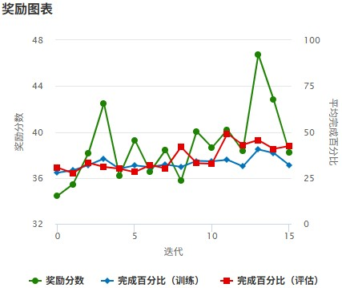
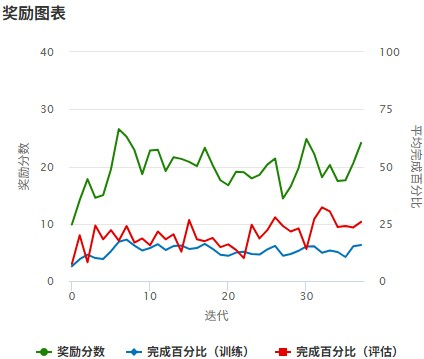
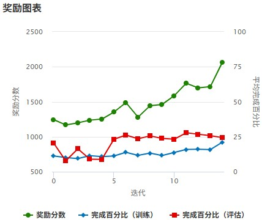
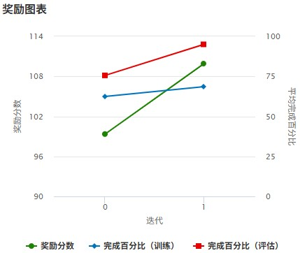

# AWS DeepRacer 訓練日誌與獎勵函數分析


本專案紀錄在機器學習的下半部分曾老師請外師來教導AI賽車，藉由實際練習以及比賽，與整學期的上課內容相互配合。本組的思路方向為藉由不斷調整 **獎勵函數 (Reward Function)**、**動作空間 (Action Space)** 與 **超參數 (Hyper‑parameters)**，讓模型經歷了「學會跟隨 → 鑽漏洞 → 求取平衡 → 穩定完賽」的演進，最終達成速度與穩定兼具的目標。


---

## 目錄

* [V1: 基礎方向追蹤模型](#v1-基礎方向追蹤模型)
* [V2: 多目標乘法獎勵模型](#v2-多目標乘法獎勵模型)
* [V3: 加權加法與進度獎勵模型](#v3-加權加法與進度獎勵模型)
* [V4: 線下延中線穩定模型](#v4-線下延中線穩定模型)
* [補充: 獎勵函數驗證製作流程與分析](#補充-獎勵函數驗證製作流程與分析)

---


## V1: 基礎方向追蹤模型

### 核心策略
獎勵函數的目標非常單純：獎勵與賽道中心線方向保持一致的行為。只要車輛的行駛方向與賽道方向的角度差在 **10度** 以內，就給予獎勵；反之則給予懲罰。

<details>
<summary><strong>點擊展開 V1 的獎勵函數、動作空間與超參數</strong></summary>

#### 獎勵函數 (V1)
```python
import math

def reward_function(params):
    '''
    主要目標是獎勵賽車使其行駛方向與賽道中心線的方向保持一致。
    '''
    # --- 1. 讀取輸入參數 ---
    waypoints = params['waypoints']
    closest_waypoints = params['closest_waypoints']
    heading = params['heading']

    # --- 2. 計算賽道方向 ---
    reward = 1.0
    next_point = waypoints[closest_waypoints[1]]
    prev_point = waypoints[closest_waypoints[0]]
    # 使用 atan2 計算兩個路標點之間連線的角度（即賽道方向），結果為徑度(radian)
    track_direction = math.atan2(next_point[1] - prev_point[1], next_point[0] - prev_point[0])
    # 將徑度轉換為角度 (degree)
    track_direction = math.degrees(track_direction)

    # --- 3. 計算方向差異並給予獎勵 ---
    # 計算賽道方向與車頭方向之間的絕對角度差
    direction_diff = abs(track_direction - heading)

    # 處理角度差大於180度的情況，確保取最小夾角
    # 例如 -170度 和 170度 的差異其實是 20度，而不是 340度
    if direction_diff > 180:
        direction_diff = 360 - direction_diff

    # 設定一個可容忍的方向誤差值（10度）
    DIRECTION_THRESHOLD = 10.0

    # 如果方向差異大於閾值，則將獎勵減半，作為懲罰
    if direction_diff > DIRECTION_THRESHOLD:
        reward *= 0.5

    # 回傳最終的獎勵值
    return float(reward)
```

#### 動作空間 (V1)
| 序號 | 轉向角 | 速度 |
|:---:|:---:|:---:|
| 0 | -30 ° | 1.6 m/s |
| 1 | -30 ° | 3 m/s |
| 2 | -15 ° | 1.6 m/s |
| 3 | -15 ° | 3 m/s |
| 4 | 0 ° | 3 m/s |
| 5 | 0 ° | 4 m/s |
| 6 | 15 ° | 1.6 m/s |
| 7 | 15 ° | 3 m/s |
| 8 | 30 ° | 1.6 m/s |
| 9 | 30 ° | 3 m/s |

#### 超參數 (V1)
| 參數 | 值 |
|:---|:---:|
|Gradient descent batch size|64|
|Number of epochs|10|
| Learning rate | 0.0003 |
| Entropy | 0.01 |
| Discount factor | 0.88 |
|Number of experience episodes between<br>each policy-updating iteration|20|
</details>

### 訓練結果分析



這是一個成功的起點，它教會了模型最基礎也是最重要的技能。模型的學習目標單一，易於收斂，為後續更複雜的策略打下了基礎

---

## V2: 多目標乘法獎勵模型

### 核心策略
採用**乘法制**獎勵，試圖同時優化多個目標。獎勵與 `方向偏差`、`離中心距離`、`速度` 等因素相乘，意圖讓模型在各方面都表現出色。

<details>
<summary><strong>點擊展開 V2 的獎勵函數、動作空間與超參數</strong></summary>

#### 獎勵函數 (V2)
```python
def reward_function(params):
'''
綜合考量：DirectionDiff, DistanceFromCenter, Speed, ProgressΔ
'''
# 讀取必要欄位
waypoints = params['waypoints']
closest_waypoints = params['closest_waypoints']
heading = params['heading']
speed = params['speed'] # 目前速度
progress = params['progress'] # 目前進度百分比
distance_from_center = params['distance_from_center']
track_width = params['track_width']
steps = params['steps']
is_offtrack = params['is_offtrack']
is_crashed = params['is_crashed']

# 1. 若出界或撞車，立即給予極低獎勵
if is_offtrack or is_crashed:
	return  1e-3

# 2. 計算賽道中心線方向與車輛 Heading 差異
next_coord = waypoints[closest_waypoints[1]]
prev_coord = waypoints[closest_waypoints[0]]
track_direction = math.degrees(
	math.atan2(
	next_coord[1] - prev_coord[1],
	next_coord[0] - prev_coord[0]
	)
)
direction_diff = abs(track_direction - heading)
if direction_diff > 180:
	direction_diff = 360 - direction_diff
  
# 3. 基礎 Reward：先以 1 為基底
reward = 1.0

# 4. 加入 distance_from_center（愈靠近中心線愈高分）
# 距離中心佔賽道寬的一定比例內，給 bonus
marker_1 = 0.1 * track_width
marker_2 = 0.25 * track_width
if distance_from_center <= marker_1:
	reward *= 1.5
elif distance_from_center <= marker_2:
	reward *= 1.0
else:
	reward *= 0.5  # 太偏邊緣，降低分數
  
# 5. 加入方向差異懲罰：連續型懲罰曲線
# 以 0~5° 為最優、5~15° 遞減、>15° 大幅懲罰
if direction_diff <= 5.0:
	reward *= 1.2
elif direction_diff <= 15.0:
	reward *= 0.8
else:
	reward *= 0.3

# 6. 車速速度獎勵：直道適合高速度，彎道要適度控制
# 速度 > 3.5（m/s）給 bonus；速度介於 2~3.5 中等；<2 慢速給懲罰
if speed >= 3.5:
	reward *= 1.3
elif speed >= 2.0:
	reward *= 1.0
else:
	reward *= 0.5  

# 7. 進度（Progress）輔助獎勵：若步數（steps）較少就達成相同期望進度，給額外加成
previous_progress = params.get('previous_progress', 0)
if progress - previous_progress > 10:
	reward *= 1.1
# 最後回傳結果
return  float(reward)
```

#### 動作空間 (V2)
| 序號 | 轉向角 | 速度 |
|:---:|:---:|:---:|
| 0 | -30 ° | 1.3 m/s |
| 1 | -30 ° | 2.7 m/s |
| 2 | -15 ° | 1.3 m/s |
| 3 | -15 ° | 2.7 m/s |
| 4 | 0 ° | 2.7 m/s |
| 5 | 0 ° | 4 m/s |
| 6 | 15 ° | 1.3 m/s |
| 7 | 15 ° | 2.7 m/s |
| 8 | 30 ° | 1.3 m/s |
| 9 | 30 ° | 2.7 m/s |

#### 超參數 (V2)
| 參數 | 值 |
|:---|:---:|
|Gradient descent batch size|64|
|Number of epochs|10|
| Learning rate | 0.0007 |
| Entropy | 0.03 |
| Discount factor | 0.96 |
|Number of experience episodes between<br>each policy-updating iteration|20|
</details>

### 訓練結果分析



> **核心問題**：獎勵分數穩定上升，但完成率始終在極低點徘徊。這意味著模型學會了**「鑽獎勵函數的漏洞」**，而非**「完成賽道」**。

模型發現在賽道的某些簡單路段可以透過中速、置中的方式持續獲得高額獎勵，因此滿足於待在這個「舒適區」刷分，而沒有足夠的動機去挑戰更困難的彎道。

---

## V3: 加權加法與進度獎勵模型

### 核心策略
改用**加法制**，並引入了多項精巧的設計，如`一次性進度獎勵`、`高斯置中獎勵`、`巨額速度權重`和`終點線激勵`，目標是讓模型以「高效完賽」為最優先。

<details>
<summary><strong>點擊展開 V3 的獎勵函數、動作空間與超參數</strong></summary>

#### 獎勵函數 (V3)
```python
import math
# --- 全域變數與超參數設定 ---
FAIL_REWARD = 1e-26                  # 失敗時給予的極低獎勵，避免為零
MAX_STEERING_ANGLE = 30              # 賽車的最大轉向角度
STEERING_GRANULARITY = 5             # 用於計算轉向懲罰的強度
MAX_SPEED = 4                        # 賽車的最大速度 (m/s)
RACELINE_RANGE = 6                   # 計算自訂賽道線時，向前/向後參考的路標點數量
WP = -1                              # 一個全域變數，用來記錄上一個已給予獎勵的路標點索引

def dist_2_points(x1, x2, y1, y2):
    '''計算兩點之間的歐幾里得距離'''
    return ((x1 - x2)**2 + (y1 - y2)**2)**0.5

def gaussian(x, mu, sig):
    '''
    高斯分佈函數 (鐘形曲線)。
    x: 輸入值 (如離中心距離)
    mu: 期望值 (曲線峰值所在位置，此處為0)
    sig: 標準差 (曲線的寬度)
    '''
    return math.exp(-((x - mu) ** 2) / (2 * (sig ** 2)))

def reward_function(params):
    '''
    採用加法制的複雜獎勵函數。
    考量了以下幾個因素：
    1. 追蹤一條平滑的自訂賽道線 (Raceline)。
    2. 使用高斯函數獎勵貼近中心線的行為。
    3. 對大角度轉向施加懲罰。
    4. 給予速度極高權重的獎勵。
    5. 在接近終點和衝線時給予巨額獎勵，強力引導模型完成賽道。
    '''
    global WP

    # --- 1. 讀取輸入參數 ---
    x = params['x']
    y = params['y']
    speed = params['speed']
    steering_angle = abs(params['steering_angle'])
    all_wheels_on_track = params['all_wheels_on_track']
    is_reversed = params.get('is_reversed', False)
    track_width = params['track_width']
    distance_from_center = params['distance_from_center']
    progress = params['progress']

    # --- 2. 失敗條件檢查 ---
    # 如果車輛出界或反向行駛，立即回傳極低獎勵並結束
    if not all_wheels_on_track or is_reversed:
        return float(FAIL_REWARD)

    # --- 3. 自訂賽道線 (Raceline) 獎勵 ---
    # 這是此函數的核心技巧之一，目的在於讓車輛學習更平滑的過彎路線（切西瓜）
    waypoints = params['waypoints']
    p = params['closest_waypoints'][1]  # 車輛前方最近的路標點索引
    wpSize = len(waypoints)

    # 為了計算平滑路線，不能只看最近的點，而是向前和向後看 RACELINE_RANGE 個點
    p_before = (p - RACELINE_RANGE) % wpSize
    p_after = (p + RACELINE_RANGE) % wpSize
    x_before, y_before = waypoints[p_before]
    x_after, y_after = waypoints[p_after]
    
    # 計算這兩個遠方參考點的中點，作為車輛當前應該追蹤的「平滑路線目標點」
    qline_x = (x_before + x_after) / 2
    qline_y = (y_before + y_after) / 2
    
    # 計算車輛當前位置與「平滑路線目標點」的距離
    dist_to_raceline = dist_2_points(qline_x, x, qline_y, y)

    # 根據與平滑路線的距離給予獎勵
    raceline_reward = 1e-3  # 預設一個極低值
    if p == WP:
        # 如果當前的路標點和上一個給過獎勵的點是同一個，不重複給獎勵以防止車輛停在一個地方反覆刷分
        raceline_reward = 1e-3
    else:
        # 如果是新的路標點，則更新 WP 並根據距離給予獎勵
        WP = p
        if dist_to_raceline < 0.05: raceline_reward = 1.0
        elif dist_to_raceline < 0.1: raceline_reward = 0.8
        elif dist_to_raceline < 0.15: raceline_reward = 0.5
    
    # --- 4. 各項獎勵分數計算 ---
    # a. 離中心線距離獎勵：使用高斯函數，越靠近中心分數越高，偏離時分數平滑下降
    distance_reward = gaussian(distance_from_center, 0, track_width / 4) * 10

    # b. 方向獎勵：對大角度轉向進行懲罰，鼓勵平順駕駛
    direction_reward = 1.0
    if steering_angle > MAX_STEERING_ANGLE / STEERING_GRANULARITY:  # 閾值為 30/5 = 6 度
        direction_reward *= 0.5

    # c. 速度獎勵：給予速度非常高的權重，是總獎勵的主要來源
    speed_reward = (speed / MAX_SPEED) * 100

    # --- 5. 匯總總獎勵與終點線加成 ---
    # 將所有獎勵相加
    reward = raceline_reward + distance_reward + direction_reward + speed_reward

    # 在賽道後段和終點提供巨額加成，強力引導模型學會「跑完全程」
    if progress > 70 and progress < 100:
        reward *= (1 + progress / 100)  # 在70%進度後，獎勵最多可加成到 1.99 倍
    elif progress >= 100:
        reward *= 5  # 衝過終點線時，獎勵直接乘以 5 倍

    # 回傳最終的獎勵值
    return float(reward)
```

#### 動作空間 (V3)
| 序號 | 轉向角 | 速度 |
|:---:|:---:|:---:|
| 0 | 30 ° | 1.4 m/s |
| 1 | 19.2 ° | 1.5 m/s |
| 2 | 6.9 ° | 1.6 m/s |
| 3 | -5.7 ° | 1.7 m/s |
| 4 | 8.1 ° | 2.3 m/s |
| 5 | -6.1 ° | 2.4 m/s |
| 6 | -0.3 ° | 2.8 m/s |
| 7 | 14.4 ° | 2.8 m/s |
| 8 | 0.3 ° | 3.3 m/s |
| 9 | 12.8 ° | 3.6 m/s |
| 10 | -10.8 ° | 3.7 m/s |
| 11 | 0.5 ° | 3.9 m/s |

#### 超參數 (V3)
| 參數 | 值 |
|:---|:---:|
|Gradient descent batch size|64|
|Number of epochs|10|
| Learning rate | 0.0003 |
| Entropy | 0.01 |
| Discount factor | 0.99 |
|Number of experience episodes between<br>each policy-updating iteration|20|
</details>

### 訓練結果分析



> **顯著進步**：獎勵分數和完成率同步穩定提升，證明模型正在朝著正確的方向學習。`Discount factor` 高達 `0.99`，配合終點線巨額獎勵，成功激勵模型以完賽為目標。

> **潛在失衡**：獎勵分數極高（2000+）的主因是 `speed_reward` 權重過高。這導致模型**過於「偏科」**，在「追求極速」和「安全過彎」之間產生衝突，限制了完成率從 25% 進一步突破。

---
## V4: 線下延中線穩定模型

線下實體車訓練以 **「穩定彎道 + 逐步提升直線速度」** 為核心策略，並採用 **延中線獎勵 (Follow the Center Line)** 以及 **離散動作空間**，成功在物理賽道上實現穩定完賽與圈速最佳化。

### 核心策略

採取 **「穩定優先」** 的策略，訓練初期著重於避免出軌，確保車輛能完整跑完賽道。接著透過**動態調速**的方式，在彎道選擇低速大轉向以維持穩定，而在直線路段則逐步導入高速小轉向的指令。隨著模型愈加成熟，進一步**逐步解鎖**高速動作，使其在保持穩定的前提下，有效壓縮總圈速並提升整體效能。

<details>
<summary><strong>點擊展開 V4 的獎勵函數、動作空間與超參數</strong></summary>

#### 獎勵函數

```python
def reward_function(params):
    track_width = params['track_width']
    distance_from_center = params['distance_from_center']

    marker_1 = 0.1 * track_width
    marker_2 = 0.25 * track_width
    marker_3 = 0.5 * track_width

    if distance_from_center <= marker_1:
        reward = 1.0
    elif distance_from_center <= marker_2:
        reward = 0.5
    elif distance_from_center <= marker_3:
        reward = 0.1
    else:
        reward = 1e-3  # 非常低的獎勵，表示接近邊界

    return float(reward)
```

#### 動作空間 (V4)
| 序號 | 轉向角 | 速度 |
| :--: | :-----: | :------: |
|   0  |   -30   |    1.2   |
|   1  |   -20   |    1.2   |
|   2  |   -20   |    2.2   |
|   3  |   -10   |    1.2   |
|   4  |   -10   |    2.2   |
|   5  |    0    |    2.4   |
|   6  |    0    |    2.7   |
|   7  |    10   |    1.2   |
|   8  |    10   |    2.2   |
|   9  |    20   |    1.2   |
|  10  |    20   |    2.2   |
|  11  |    30   |    1.2   |
|  12  |    0    |    3.0   |
|  13  |    0    |    3.2   |

> **應用訣竅**：轉彎時選擇低速＋大角度指令，直線則切換到高速指令 (12、13) 以爭取最快圈速。

### 超參數（V4）
| 參數 | 值 |
|:---|:---:|
|Gradient descent batch size|64|
|Number of epochs|10|
| Learning rate | 0.0003 |
| Entropy | 0.01 |
| Discount factor | 0.88 |
|Number of experience episodes between<br>each policy-updating iteration|20|
</details>
### 訓練結果分析



> **穩定提升**：獎勵分數由 99 穩定提升至 109，訓練與評估完成率也呈現同步上升趨勢，顯示策略設計有效，值得注意的是，評估完成率持續高於訓練完成率，代表模型不僅在訓練環境中收斂良好，也展現出良好的泛化能力。

> **策略奏效**：透過「穩定優先 → 動作提速」的階段性訓練邏輯，模型能夠在彎道保持穩定、在直線加速衝刺，成功實現速度與安全性的雙重目標，並有效優化總圈速表現。

## 補充: 獎勵函數驗證製作流程與分析

### 一、驗證流程概述

此流程主要用來**離線模擬 AWS DeepRacer 環境中的獎勵函數行為**，檢視模型在實際跑道資料下的表現與回饋。整體流程可分為以下幾步：

#### 1. 載入 Waypoints 和訓練紀錄（CSV）

-   使用 `.npy` 格式的跑道 `waypoints` 代表中心線。
    
-   使用 simulator 所輸出的 `sim-trace` CSV 記錄車輛的 heading、位置與 waypoint index 等。
    

#### 2. 套用 Reward Function 計算分數

-   根據每一筆資料的 heading 以及對應的 closest waypoints，計算 reward。
    
-   累積所有 reward 以獲得統計數據。
    

#### 3. 執行驗證與統計分析

-   計算 reward 的平均值、最大值、最小值與標準差。
    
-   驗證 CSV 的 waypoint index 是否與 `.npy` 的長度一致（避免 index error）。
    

----------

### 二、主程式檔案說明：`smart_car_reward_test.py`

####  核心函數與功能說明

| 函數名稱                                              | 說明                                         |
| ------------------------------------------------- | ------------------------------------------ |
| `reward_function(params)`                         | 根據 heading 與軌道方向夾角差計算 reward<br>（大於 10 度則懲罰）。  |
| `count_waypoints_from_array(array)`               | 統計並列印 waypoints 的總數。                       |
| `check_waypoint_consistency(npy_array, csv_path)` | 檢查 CSV 中使用到的最大 waypoint index 是否超出 npy 長度。 |

####  最終輸出統計

```text
=== Reward 統計結果 ===
總 Reward 值: 647.5000(實際上為1236.5)
有效資料筆數: 1085
平均 Reward 值: 0.5968
最大 Reward 值: 1.0000
最小 Reward 值: 0.5000
Reward 標準差: 0.1975
=== 賽道Waypoints統計結果 ===
該賽道共有 71 個中心線 waypoints。
✅ waypoint 總數（.npy 檔）: 71
📄 CSV 中最大 closest_waypoint: 117
⚠️ 警告：CSV 中的 closest_waypoint 超過 npy 中的 waypoint 點數！
➡️ 你可能會錯過部分 reward 計算或發生 IndexError。
```

----------

### 三、參考輔助分析檔案

####  `smart_car_steer.py`：檢查 steer 是否超出合理區間（-30 ~ +30）

```python
out_of_bounds = df[(df['steer'] < -30) | (df['steer'] > 30)]

```

- 可找出異常轉向行為

----------

####  `smart_car_throttle.py`：檢查 throttle 合理性（1.3 ~ 4.0）

```python
out_of_bounds = df[(df['throttle'] < 1.3) | (df['throttle'] > 4.0)]

```
- 有助於偵測速度控制異常

----------

####  `smart_car_yaw.py`：以圖形方式呈現每個 episode 的 yaw（航向角）變化

```python
axes[i].plot(episode_data['steps'], episode_data['yaw'])

```

- 觀察控制策略的穩定性與一致性

----------


###  四、驗證結論
1.  **獎勵函數整體邏輯正常**
    
    -   能成功根據 `heading` 與 `track_direction` 夾角差給予獎勵或懲罰。
        
    -   Reward 值具變異性，平均值、最大/最小值與標準差皆如預期產出。
        
2.  **Waypoint 資料一致性需注意**
    
    -   驗證發現：CSV 中的 `closest_waypoint` index 若超出 `.npy` 檔案中的 waypoint 總數，將可能導致 IndexError 或錯誤 reward 計算。
        
    -    **建議在每次模型訓練或驗證前先執行 `check_waypoint_consistency()` 檢查。**
        
3.  **資料邊界值需控管**
    
    -   從 `steer`、`throttle` 及 `yaw` 檔案觀察：
        
        -   部分訓練資料可能存在超出可控制範圍的異常值。
            
        -   建議加入異常偵測機制或資料前處理來排除不合理輸入。
            


