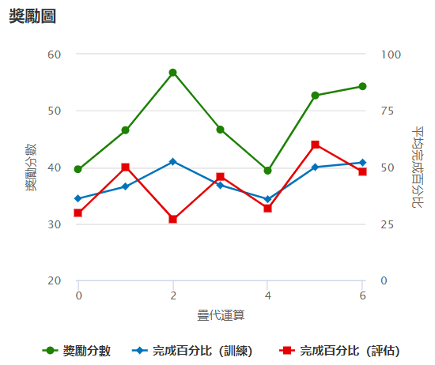
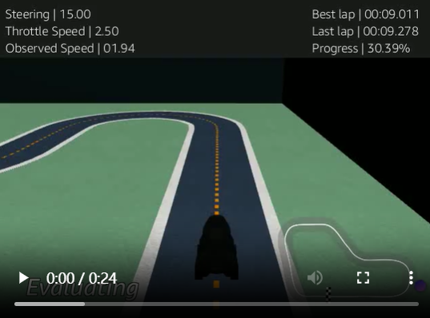

## 🧪 第二次 Fine-tune 模型（v1.1）

在 v1.0 穩定模型基礎上進行微調，本次 fine-tune 嘗試提升過彎效率與速度穩定性，**訓練時間從 120 分鐘縮短為 30 分鐘**，同時**調整動作空間與獎勵函數**。

---

### ✅ 訓練結果圖（逐步改善）



- 訓練總獎勵相比 v1.0 仍在穩定成長，但提升速率較慢，可能因訓練時間縮短。
- 評估完成率從穩定 100% 降為震盪型 50% 左右，可能需更長時間收斂。

---

### 🔍 評估影片截圖



- 圈速從 `11.062 秒`（v1.0）明顯提升至 `9.011 秒`。
- 表現明顯更快，但穩定性略降（從 100% 降至中段收斂）。

---

### ⚙️ 模型設定摘要

- 🛣 賽道：`re:Invent 2018（逆時針）`（與 v1.0 相同）
- ⏱ 訓練時長：**由 120 分鐘 → 改為 30 分鐘**
- 🤖 演算法：PPO
- 🎥 感測器：相機（與 v1.0 相同）

#### 🧮 超參數設定

| 超參數         | 值         |
|----------------|------------|
| batch size     | 64         |
| epochs         | 10         |
| learning rate  | 0.0003     |
| entropy        | 0.01       |
| discount       | 0.99       |
| loss type      | Huber      |
| 更新頻率        | 20         |

---

### 🕹 動作空間設定（共 10 組）

- 相比 v1.0，**本次將轉向角為 ±30° 與 ±15° 的動作速度各增加 0.5 m/s**，以提升過彎區段的整體通過速度。
- 同時保留 0° 高速直線，維持 3.0 / 4.0 m/s 衝刺穩定性。

| 序號 | 轉向角 (°) | 速度 (m/s) |
|------|------------|------------|
| 0    | -30        | 1.5        |
| 1    | -30        | 2.0        |
| 2    | -15        | 2.0        |
| 3    | -15        | 2.5        |
| 4    | 0          | 3.0        |
| 5    | 0          | 4.0        |
| 6    | 15         | 2.0        |
| 7    | 15         | 2.5        |
| 8    | 30         | 1.5        |
| 9    | 30         | 2.0        |

---

### 🧠 使用的獎勵函數（v1.1）

📌 **變化重點：**
- v1.1 新增了「根據中心距離分段評分」的設計，並加入「速度獎勵」。
- 新增出界懲罰邏輯，讓車輛學會穩定貼中線高速行駛。

```python
def reward_function(params):
    # 提取參數
    all_wheels_on_track = params['all_wheels_on_track']
    distance_from_center = params['distance_from_center']
    track_width = params['track_width']
    speed = params['speed']

    # 基礎獎勵
    reward = 1e-3

    # 獎勵中心行駛：越靠中心，分數越高
    marker_1 = 0.1 * track_width
    marker_2 = 0.25 * track_width
    marker_3 = 0.5 * track_width

    if distance_from_center <= marker_1:
        reward = 1.0
    elif distance_from_center <= marker_2:
        reward = 0.5
    elif distance_from_center <= marker_3:
        reward = 0.1
    else:
        reward = 1e-3  # 太偏離中心

    # 獎勵速度（鼓勵快但不失控）
    if all_wheels_on_track and speed >= 2.0:
        reward *= 1.5
    elif not all_wheels_on_track:
        reward = 1e-3  # 出界嚴懲

    return float(reward)


